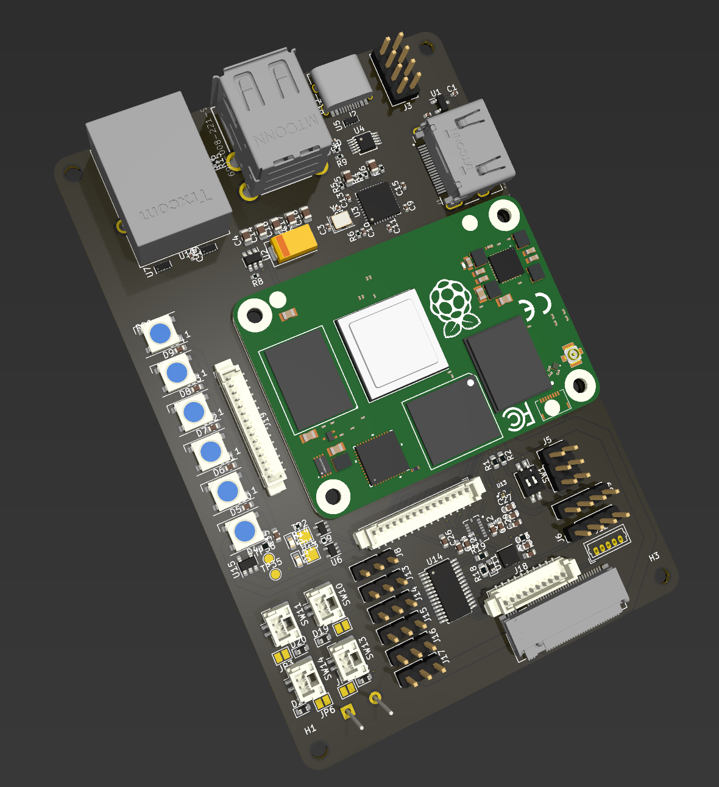

# Carrier Board

## Outline

The MUREX Carrier Board is the world's first open-source CM4-based ROV (robotics) control board.

With a physical footprint of 110 mm x 73mm (4.33 in x 2.88 in), the MUREX Carrier Board is suitable for highly compact applications. Note that this board is heavily reliant on the MUREX Power Board, connected through the M.2 (Key A) connector.

## Detailed Description

The MUREX Carrier Board is a four-layer carrier board for the Raspberry Pi Compute Module 4, designed for ROV/robotics applications. The design is highly specific for ROV control, utilizing a PCA9685 16 channel PWM driver, BME680 environmental sensor, a MEMS sensor that combines the BMI088 accelerometer and gyroscope along with a MMC5603NJ magnetometer, and a header pin array for the MS5837 underwater pressure sensor. *All GPIO pins are broken out through the two 1x15 vertical Picoblade connectors.* The MUREX Carrier Board offers many status and debugging features, such as hard resets toggles, wireless communication toggles, Neopixel array, piezoelectric buzzer, I2C screen and a leak detection matrix. The board is equipped with Gigabit Ethernet, 4x USB 2.0 (2x USB-A, 2x 1x5 header pins), USB-C (CC1/CC2 pulled low with 5.1kΩ resistors), and HDMI. The MUREX Carrier Board is also designed for highly embedded applications in mind, implementing external magnetics for Ethernet, direct 5V input and ample mounting positions. Please note that for space efficiency, it does not do any on-board power management. The MUREX Carrier Board expects clean, protected +5V input.

### CM4

- HDMI
- USB 2.0
- Ethernet (w/ POE)
- Hard power on and reset

### Sensors/IC

- PCA9685 (pwm)
- BME680 (gas)
- MMC5603NJ (magneto)
- BMI088 (accel/gyro)
- MS5837 (depth)
- Neopixel (debug/status)
- Piezo Buzzer (debug/status)
- Screen (debug/status)
- Light strip (debug/status)
- Leak detection matrix (ROV-specific)

## Progress

### Schematics

#### To Do

- [ ] 5V pads + diode for external testing
- [ ] Impedance matched traces
- [ ] Amplification required for leak detection matrix?
- [ ] External magnetics for Ethernet
  - [X] Work in progress
- [ ] Break out expensive sensors
- [ ] Route PCB
  - [X] Work in progress, V2
- [ ] Mounting holes for Ethernet Switch, PLC and Power board

#### Completed

- [X] Smaller crystal `Y1`
- [X] PicoBlade from ESC Carrier
- [X] Sensors
- [X] CM4
- [X] Neopixel
- [X] Footprint
- [X] Preliminary Research
- [X] Footprint Linking

#### Concerns

- Ethernet is a complicated protocol involving magnetic coupling
  - LX200V20 EVB has the same concern

#### Solutions

- Current solution:
  - Modify existing network switch
    - Utilize breakout for higher efficiency