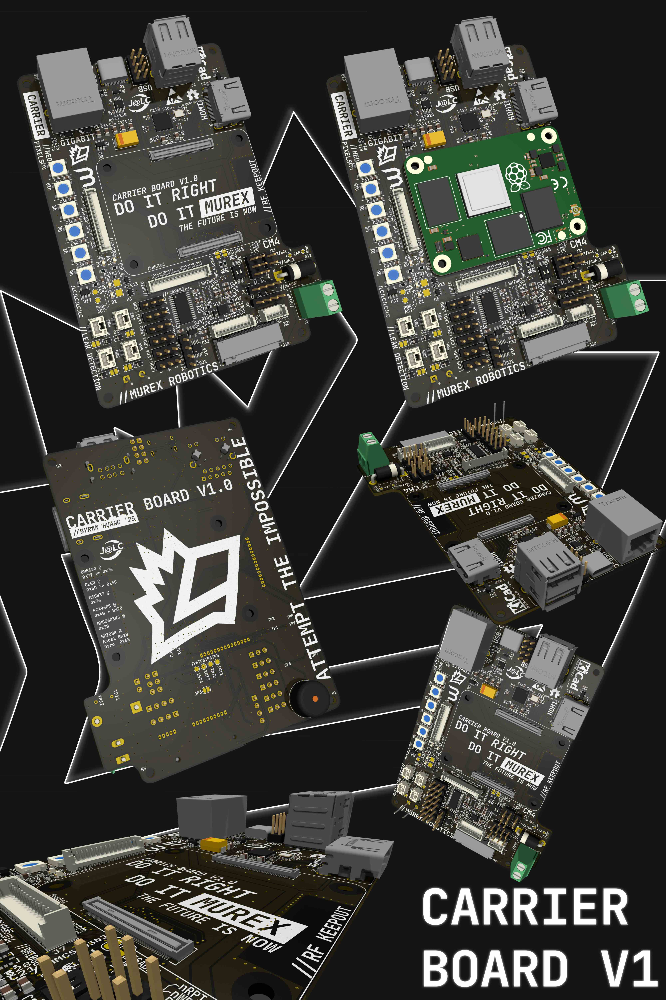
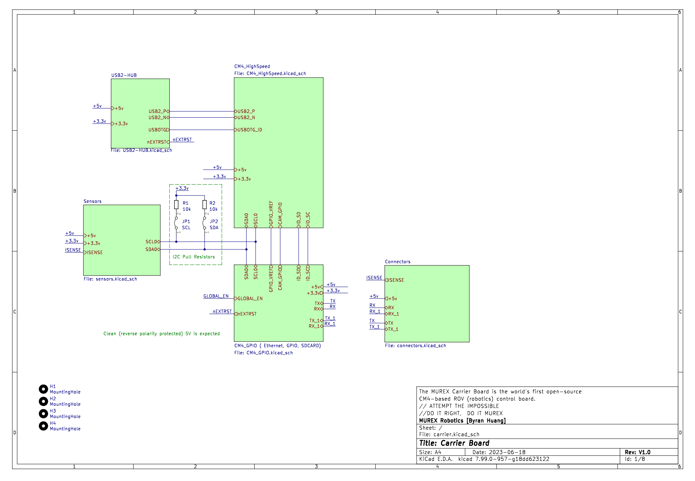

# Carrier Board

## Outline

The MUREX Carrier Board is the world's first open-source CM4-based ROV (robotics) control board.

With a physical footprint of 110 mm x 73mm (4.33 in x 2.88 in), the MUREX Carrier Board is suitable for highly compact applications. Note that this board is heavily reliant on the MUREX Power Board, connected through the M.2 (Key A) connector.

## Detailed Description

The MUREX Carrier Board is a four-layer carrier board for the Raspberry Pi Compute Module 4, designed for ROV/robotics applications. The design is highly specific for ROV control, utilizing a PCA9685 16 channel PWM driver, BME680 environmental sensor, a MEMS sensor that combines the BMI088 accelerometer and gyroscope along with a MMC5603NJ magnetometer, and a header pin array for the MS5837 underwater pressure sensor. *All GPIO pins are broken out through the two 1x15 vertical Picoblade connectors.* The MUREX Carrier Board offers many status and debugging features, such as hard resets toggles, wireless communication toggles, Neopixel array, piezoelectric buzzer, I2C screen and a leak detection matrix. The board is equipped with Gigabit Ethernet, 4x USB 2.0 (2x USB-A, 2x 1x5 header pins), USB-C (CC1/CC2 pulled low with 5.1kΩ resistors), and HDMI. The MUREX Carrier Board is also designed for highly embedded applications in mind, implementing external magnetics for Ethernet, direct 5V input and ample mounting positions. Please note that for space efficiency, it does not do any on-board power management. The MUREX Carrier Board expects clean, protected +5V input.

### Current Status

- Initial design `V1.0` complete
  - Waiting for production `"tape-out"`

### CM4 I/O

- HDMI
- USB 2.0 as `host`
- USB-C as `device`
- Giagbit ethernet
- Hardware power on and reset
- Two pairs of I2C and UART lanes

### Integrated Sensors/ICs

- `PCA9685` (PWM)
  - Wide range of control for ESCs, servos or any other PWM device
- `BME680` (Enclosure Pressure, Humidity, Temperature, VOC)
  - Accurate environmental sensor within enclosure
- `MMC5603NJ` (Magnetometer) and `BMI088` (IMU)
  - High accuracy 9-DOF MEMS sensor (±1˚ magnetic heading, ±0.004˚/s gyroscopic heading, ±0.09 mg acceleration)
- `MS5837` (Environmental Pressure)
  - High accuracy, high depth pressure sensor (±2 mm altitude/depth, ±1 C˚ temperature)
- Neopixel (Debug/Status)
  - 6 daisy chained WS2812B LEDs
- TDK Buzzer (Debug/Status)
- Adafruit Screen (Debug/Status)
- 5V and 3.3V power rail LEDs (Debug/Status)
  - Calculated current draw with 1kΩ resistor in series
- PWR and ACT CM4 LEDs (Debug/Status)
- Leak detection 2x2 high precision matrix
  - Intended to work with the Blue Robotics Leak Sensors or any other JST-GH size sensor (ROV-specific)
  - Pinpoint the leak with the same anti-ghosting technology from gaming keyboards

### [Schematic (PDF)](../pdf/schematics/carrier_v1.0_schematic.pdf)

### To Do

- [ ] Amplification required for leak detection matrix? (still unsure)
- [ ] External magnetics for Ethernet
  - [X] Work in progress
