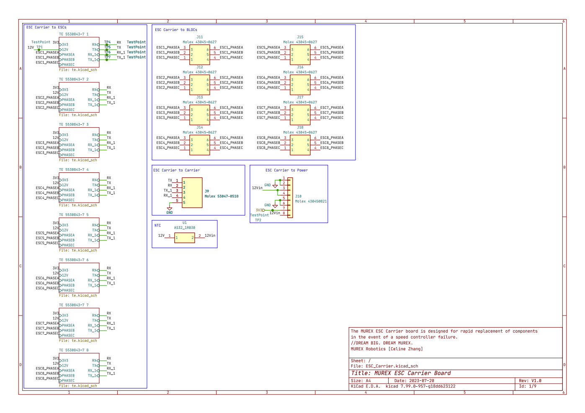

# ESC Carrier Board

The MUREX ESC Carrier board is designed to modularize ESCs. In the event of a speed controller failure, the ESC Carrier Board allows for rapid replacement of the components through a highly modular design and hotswap interface. It has a footprint of 201.7 mm x 85.6 mm (7.94 in x 3.37 in).

## Current Status

`V1.0` complete but not yet tested

## Detailed Description

The MUREX ESC Carrier board is a two-layer carrier board that can hold up to 8 ESCs. The ESCs are protected from inrush current by Ametherm's AS32_1R030 NTC thermistor. The board receives 12V and 3.3V input from the MUREX Power Board via the 8-channel Molex 43045-0821 Micro-Fit connector, and data is exchanged via the 2-wire UART protocol with the MUREX Carrier Board through the 5-channel Molex 53047-0510 PicoBlade. The TE 5530843-7 connector is used to connect the ESCs to the MUREX ESC Carrier Board. The Molex 43045-0627 Micro-Fit connector is used to output the ESC phases to the brushless DC motors.

### Ametherm AS32_1R030 (NTC Thermistor)

- Datasheet: https://www.ametherm.com/datasheetspdf/AS321R030.pdf
- 12V input and output
- 30A maximum stable current
- 1Ω resistance at 25°C
- 0.03Ω resistance at 15A
- 0.01Ω resistance at 30A

### Molex 43045-0821 Micro-Fit (to MUREX Power Board)

- Datasheet: https://www.molex.com/en-us/products/part-detail/430450821?display=pdf
- 8.5A maximum current per position
- Right-angle mating
- 8 positions (2 x 4)
- 12V input to ESCs (through NTC thermistor)
    - 3 positions
- 3.3V input for RP2040 on ESCs
    - 1 positions
- Remaining 4 positions used for grounding

### Molex 53047-0510 PicoBlade (to MUREX Carrier Board)

- Datasheet: https://www.molex.com/en-us/products/part-detail/530470510?display=pdf
- 1.0A maximum current per position
- Vertical mating
- 5 positions (1 x 5)
- 2 UART channels (1 primary and 1 backup)
    - 4 position
- Remaining position used for grounding

### TE 5530843-7 (to ESCs)

- Datasheets:
    - https://www.te.com/commerce/DocumentDelivery/DDEController?Action=showdoc&DocId=Catalog+Section%7F1773096_SEC03_CARD_EDGE%7F0210%7Fpdf%7FEnglish%7FENG_CS_1773096_SEC03_CARD_EDGE_0210.pdf%7F5530843-7
    - https://www.te.com/commerce/DocumentDelivery/DDEController?Action=showdoc&DocId=Specification+Or+Standard%7F114-13018%7FC%7Fpdf%7FEnglish%7FENG_SS_114-13018_C.pdf%7F5530843-7
- 3.0A maximum current per position
- 60 positions (2 x 30)
- Sends power to ESCs
    - Protected 12V (18 positions)
    - 3.3V (2 positions)
- Sends UART data from MUREX Carrier Board to ESCs (2 positions per channel, 4 positions total)
- Sends ESC phases to BLDC motors (through Molex 43045-0627 Micro-Fit connector)
    - 6 positions per phase, 18 total
- Remaining 18 positions used for grounding

### Molex 43045-0627 Micro-Fit (to BLDC Motors)

- Datasheet: https://www.molex.com/en-us/products/part-detail/430450627?display=pdf
- 8.5A maximum current per contact
- 6 positions (2 x 3)
- Sends ESC phases to BLDC motors (2 positions per phase, 6 positions total)

### [Schematic (PDF)](../pdf/schematics/esc_carrier_v1.0_schematic.pdf)

## To Do

- [ ] `V1.0` testing