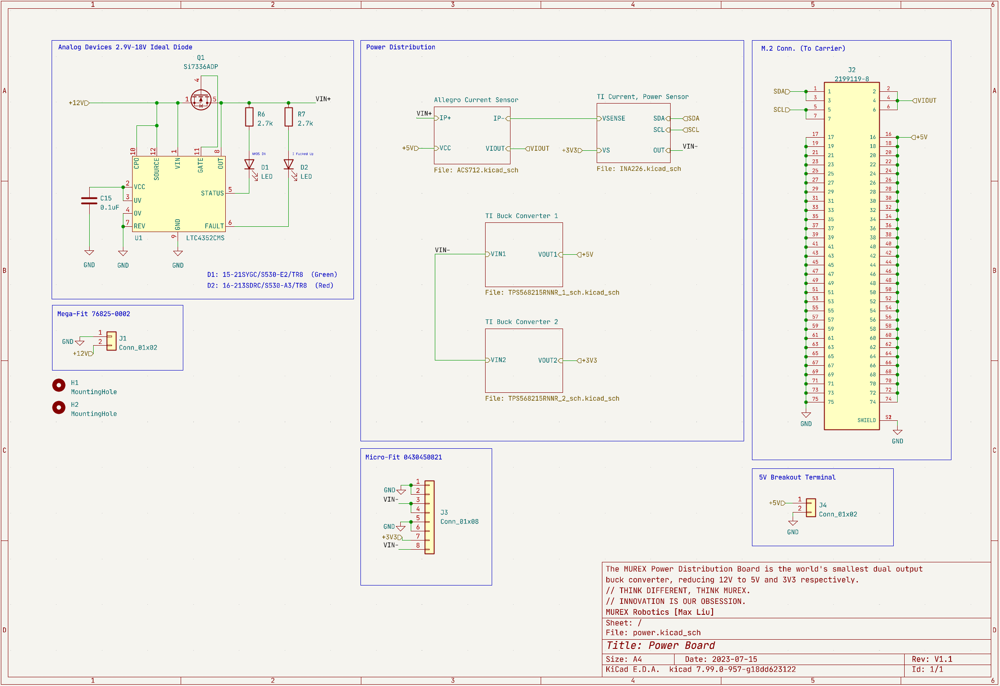

# Power Board

## Outline

The MUREX Power Board is the world's smallest dual-output buck converter, reducing an input voltage of 12V to 5V and 3V3 respectively. Integrated current sensors and circuit protection combined with microscopic physical dimensions measuring 40mm x 56mm (1.6″ x 2.2″) renders the power board an elite feature of MUREX electronics.

## Detailed Description

The MUREX Power Board is a robust four-layer power distribution module designed for ROV/robotics and other high current applications. The board expects clean 12V input from a power supply, though it can safely handle input voltages up to 17V. The board utilizes two TPS568215 buck converters to provide 5V output to the [MUREX Carrier Board](https://docs.murexrobotics.com/elec/boards/carrier.html) via an M.2 connector (Key A), and 12V + 3V3 output to the [ESC Carrier Board](https://docs.murexrobotics.com/elec/boards/esc_carrier.html) through a horizontal microfit connector. The TPS568215 features integrated MOSFETs, a default soft-start of 1ms, and a maximum output current of 8A. A LTC4352 Ideal Diode uses an external mosfet to provide reverse polarity protection and shorting safeguards via a fast turn-off, and status LEDs indicate safe power input. Power monitoring is provided by two integrated current sensors: The ACS712 is a hall-effect based current sensor IC with an optimized range of ±30A, converting the magnetic field generated to a proportional voltage output. The INA226 is a shunt-based power monitor interfaced through I2C, sensing current, voltage, and power. The analog output and I2C lines are routed to the M.2 connector, to be analyzed by the [MUREX Carrier Board](https://docs.murexrobotics.com/elec/boards/carrier.html).

## Current Status

- `V1.0` Complete
  - `V1.1` Revisions in progress

## Integrated Sensors and ICs

- [TPS568215RNNR](https://www.ti.com/product/TPS568215?dcmp=dsproject&hqs=pf) Buck Converter
  - 4.5V-17V input, 0.6V-5.5V output
  - Integrated MOSFETs
  - 8A maximum output current
  - Synchronous rectification, built in soft-start
  - ∼90-95% efficiency
- [LTC4352](https://www.analog.com/en/products/ltc4352.html) Analog Devices Ideal Diode
  - 2.9V-18V Input
  - Reverse current disabled by default
  - Si7336ADP used as external NMOS
  - Status LEDs: Everlight Electronics Green and Red Diodes
- [ACS712](https://www.allegromicro.com/en/products/sense/current-sensor-ics/zero-to-fifty-amp-integrated-conductor-sensor-ics/acs712) Current Sensor IC
  - Hall-effect based
  - Selected part optimized for ±30A measurements
  - Proportional analog output signal, conversion to measured current in datasheet
- [INA226](https://www.ti.com/product/INA226) Current, Voltage, Power Monitor
  - Shunt-resistor based
  - Voltage sensing from 0V-36V
  - Reports current, voltage, and power
  - Jumper allows backup I2C address

### [Schematic (PDF)](../pdf/schematics/power_v1.1_schematic.pdf)

### To Do

- [ ]  Write "To Do" section

### Changelog

V1.0:

- Initial Design

V1.1:
